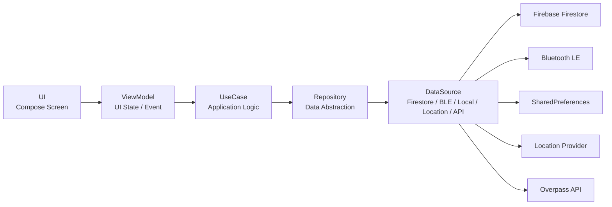
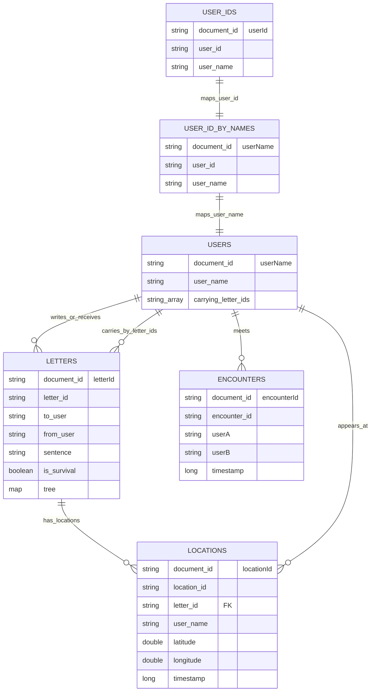
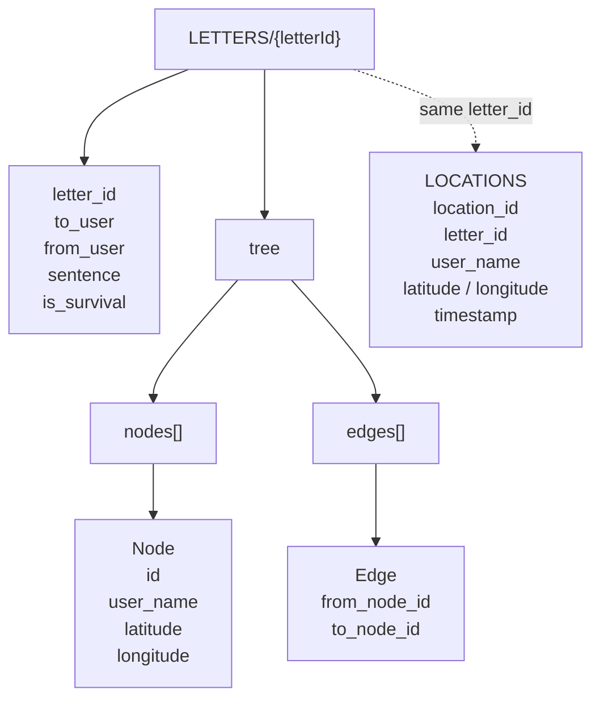
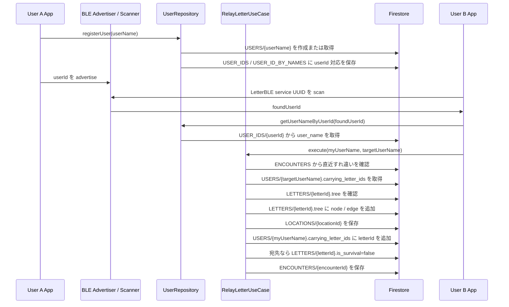

# sheep relay

[](https://developer.android.com/)
[](https://kotlinlang.org/)
[](https://firebase.google.com/)
[](https://developer.android.com/develop/connectivity/bluetooth/ble/ble-overview)
[](https://developers.google.com/maps)

**sheep relay** は、BLE のすれ違い通信を使って、手紙を人づてに届ける Android アプリです。

通常のメッセージアプリのように宛先へ直接送るのではなく、ユーザー同士がすれ違うたびに手紙が中継され、宛先のユーザーへ届いた時点で配達が完了します。

## Demo

> デモ動画は撮影後に追加予定です。
<!--
```md
<!-- Example 

```

README には、最初に短いメインデモを 1 本置き、必要に応じて機能別の補足動画を追加する方針です。

推奨構成:

| Priority | Video | Length | Purpose |
|---|---|---:|---|
| 1 | Main Demo | 30-60 sec | アプリの体験全体を短く伝える |
| 2 | Letter Submission | 15-30 sec | 手紙作成からポスト投函までを見せる |
| 3 | Relay / Delivery | 15-30 sec | BLE のすれ違い中継と到達を見せる |
| 4 | Route Visualization | 15-30 sec | 届いた手紙の経路表示を見せる |

長い動画 1 本だけにすると、README を見た人が最後まで見ない可能性があります。そのため、README の先頭には短いメインデモを置き、詳しく見たい人向けに機能別動画を分けて載せるのが適しています。

撮影時の想定:

- メインデモは、手紙を書く、投函する、中継される、届く、経路を見る、という体験を短くつなげる
- 機能別動画は、1 本につき 1 つの見せ場だけに絞る
- README に埋め込む GIF は 10-20 秒程度に抑える
- 発表用には動画ファイル、README 用には短い GIF または圧縮した MP4 を用意する
- BLE の実演が不安定な場合は、成功済みの録画を使う
-->
## Concept

現代のメッセージアプリは、すぐ届き、すぐ読めて、すぐ返信できます。

sheep relay は、あえて「すぐ届かない」体験を作ることで、手紙を待つ時間、偶然のすれ違い、届いたときの嬉しさをデジタル上で再現することを目指しました。

手紙は送信者から受信者へ一直線に届くのではなく、複数のユーザーを経由して移動します。届いた手紙では、本文だけでなく、その手紙がたどった経路も確認できます。

## Features

- ユーザー名によるユーザー登録
- 宛先と本文を指定した手紙作成
- 下書き保存
- 実在するポストを選択した投函
- BLE による周辺ユーザー検知
- すれ違いをきっかけにした手紙の中継
- 受信した手紙の一覧・詳細表示
- 配達中の手紙の一覧・詳細表示
- 手紙がたどった経路の地図表示
- BLE 用 Foreground Service / Quick Settings Tile

## Tech Stack

| Area | Technology |
|---|---|
| Language | Kotlin |
| UI | Jetpack Compose, Material 3 |
| Navigation | Navigation Compose |
| Database | Firebase Firestore |
| Local Storage | SharedPreferences |
| Communication | Bluetooth Low Energy |
| Location | Google Play Services Location |
| Map | Google Maps Compose |
| Post Search | Overpass API |
| Build | Gradle |

## Architecture

このプロジェクトでは、UI とデータ取得処理が直接結合しないように、レイヤーを分けて実装しています。



主な責務は以下の通りです。

| Layer | Responsibility |
|---|---|
| UI | ViewModel の state を描画し、ユーザー操作を通知する |
| ViewModel | 画面状態の管理、UseCase / Repository の呼び出しを行う |
| UseCase | 投函、中継、経路生成などのアプリ固有ロジックを扱う |
| Repository | DataSource を隠蔽し、ドメイン寄りの API を提供する |
| DataSource | Firestore、BLE、位置情報、ローカル保存、外部 API と接続する |

## Data Model

Firestore では、`FirestoreCollections` / `FirestoreFields` に定義した collection 名・field 名を使い、ユーザー、BLE 通信用 ID、手紙、位置履歴、すれ違い履歴を分けて管理しています。

アプリ内の `User` モデルは `userName` と `carryingLetterIds` を持ちます。一方で、BLE 広告にはユーザー名ではなく短い `userId` を載せるため、Firestore には `USER_IDS` と `USER_ID_BY_NAMES` の対応表も保存しています。



`LETTERS/{letterId}.tree` は、経路表示で使う正のデータとして扱っています。`LOCATIONS` は投函・中継地点の履歴として保存し、古いデータや tree が空の場合の復元にも使います。



## Relay Flow

手紙の中継は、BLE で検知した `userId` を `userName` に解決してから実行します。`RelayLetterUseCase` は、重複 encounter の確認、相手が運搬中の手紙取得、tree への node / edge 追加、位置履歴保存、宛先到達判定をまとめて扱います。



## Directory Structure

```text
app/src/main/java/com/example/letterble
├── data/
│   ├── datasource/
│   │   ├── ble/
│   │   ├── firestore/
│   │   ├── local/
│   │   ├── location/
│   │   └── remote/
│   └── repository/
├── di/
├── domain/
│   ├── model/
│   └── usecase/
├── feature/
│   ├── carry/
│   ├── edit_letter/
│   ├── home/
│   ├── received/
│   └── register/
├── navigation/
├── notification/
├── service/
└── ui/
    ├── components/
    └── theme/
```

## Requirements

- Android Studio
- Android SDK
- Firebase project
- Google Maps API key
- BLE を利用できる Android 端末

## Setup

1. Firebase プロジェクトを作成し、Android アプリを登録します。
2. `google-services.json` を `app/` 配下に配置します。
3. Google Maps API key を `local.properties` に追加します。

```properties
MAPS_API_KEY=your_api_key
```

4. Debug APK をビルドします。

```bash
./gradlew :app:assembleDebug
```

## Test

```bash
./gradlew test
```

## Usage

1. アプリを起動し、ユーザー名を登録します。
2. 宛先と本文を入力し、手紙を作成します。
3. 現在地周辺のポストを選択し、手紙を投函します。
4. BLE により、すれ違ったユーザーへ手紙が中継されます。
5. 宛先のユーザーに届くと、受信一覧から手紙を確認できます。
6. 届いた手紙の詳細画面で、本文と経路を確認できます。

## Demo Scenario

発表や動作確認では、以下のシナリオを想定しています。

```text
1. User A が User C 宛てに手紙を投函する
2. User A と User B がすれ違う
3. User B が User C とすれ違う
4. User C の受信一覧に手紙が表示される
5. User C が本文と経路を確認する
```

## Future Work

- 手紙デザインのカスタマイズ
- 受信した手紙へのリアクション
- バックグラウンド中継の安定化
- 経路表示 UI の改善
- デモ用データ投入・検証フローの整備

## Team

チーム **WHAT YOU’R NAME**

| Role | Member |
|---|---|
| Development | TBD |
| Design | TBD |
| Presentation / Support | TBD |
