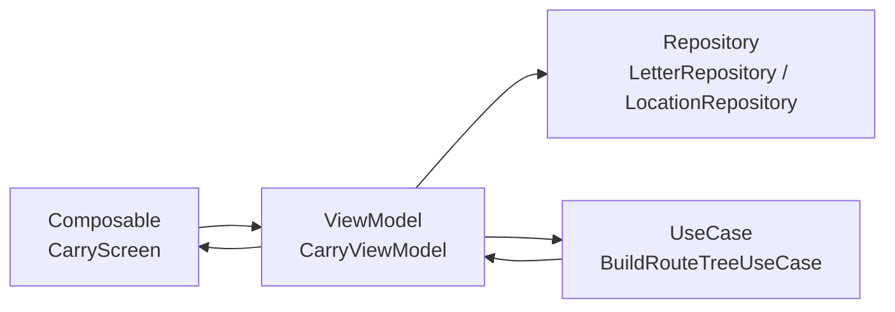

# Carry Screen（運搬画面）

## 構成図

---

## 層構造

### UI（Composable）

- CarryScreen（一覧）
- CarryDetailScreen（詳細）
- CarryMapScreen（ツリー可視化）

---

### ViewModel

- CarryViewModel
    - loadCarryingLetters()
    - onLetterClicked(letterId)
    - loadLetterDetail(letterId)

---

### Repository

#### LetterRepository

- getCarryingLetters(userName)
- getLetter(letterId)

#### LocationRepository

- getLocationsByLetter(letterId)

---

### UseCase

#### BuildRouteTreeUseCase

- buildTree(locations)

---

## 状態（UiState）

CarryUiState

- letters : List<LetterSummary>
- selectedLetter : LetterDetail?
- routeTree : Tree?
- currentUserName : String
- isLoading : Boolean
- errorMessage : String?

---

## ボタン / イベント

手紙選択ボタン

- onClick → onLetterClicked

戻るボタン

- Navigation処理

---

## データ構造

### LetterSummary

- letterId : Int
- to : String

---

### LetterDetail

- letterId : Int
- from : String
- to : String
- sentence : String

---

### Location

- latitude : Double
- longitude : Double
- userName : String

---

### Tree

- nodes : List<Node>
- edges : List<Edge>

---

### Node

- id : String
- userName : String
- latitude : Double
- longitude : Double

---

### Edge

- fromNodeId : String
- toNodeId : String

---

## 表示ロジック（UI）

### ノード色分け

if (node.userName == currentUserName)

- 自分のノード → 強調色

else

- 通常ノード → デフォルト色

---

### エッジ色分け

if (fromNode.userName == currentUserName)

- 自分から伸びるエッジ → 強調色

else

- 通常エッジ → デフォルト色
