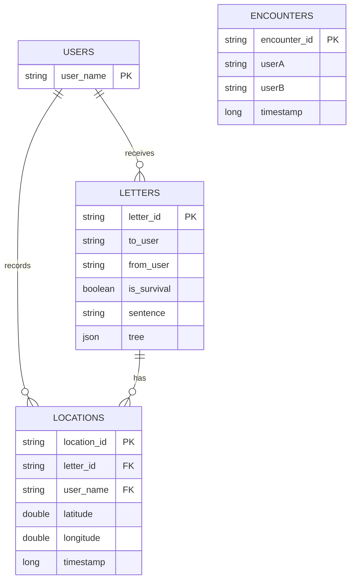

# Database ER Diagram

```mermaid
erDiagram

    USERS {
        string user_name PK
    }

    LETTERS {
        string letter_id PK
        string to_user
        string from_user
        boolean is_survival
        string sentence
        json tree
    }

    LOCATIONS {
        string location_id PK
        string letter_id FK
        string user_name FK
        double latitude
        double longitude
        long timestamp
    }

    ENCOUNTERS {
        string encounter_id PK
        string userA
        string userB
        long timestamp
    }

    USERS ||--o{ LOCATIONS : "records"
    LETTERS ||--o{ LOCATIONS : "has"
    USERS ||--o{ LETTERS : "receives"
```
