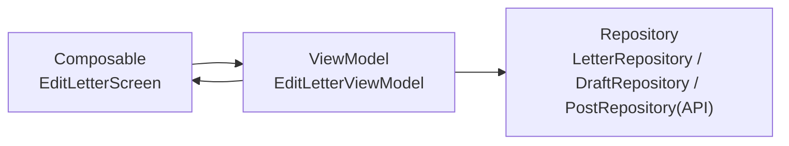

# Edit Letter Screen（手紙作成画面）

## 構成図

---

## 層構造

### UI（Composable）

- EditLetterScreen
- PostSelectScreen

---

### ViewModel

- EditLetterViewModel
    - onToChanged(text)
    - onSentenceChanged(text)
    - onSaveDraftClicked()
    - onSelectPostClicked()
    - onPostSelected(post)
    - onSubmitClicked()

---

### Repository

#### DraftRepository

- saveDraft(draft)
- loadDraft()
- clearDraft()

#### LetterRepository

- sendLetter(letter)

#### PostRepository（外部API）

- getNearbyPosts(lat, lon)

---

### UseCase

- なし（現時点）

---

## 状態（UiState）

EditLetterUiState

- toName : String
- sentence : String
- selectedPost : Post?
- posts : List<Post>
- (isLoading : Boolean)
- (errorMessage : String?)

---

## ボタン / イベント

宛先入力

- onValueChange → onToChanged

本文入力

- onValueChange → onSentenceChanged

下書き保存ボタン

- onClick → onSaveDraftClicked

投函ボタン

- onClick → onSelectPostClicked

ポスト選択ピン

- onClick → onPostSelected

送信ボタン

- onClick → onSubmitClicked

---

## データ構造

### Post

- id : String
- latitude : Double
- longitude : Double
- name : String

---

## 補足（仕様反映）

- ポスト一覧は外部APIから取得
- ViewModelはAPIを直接呼ばない
- RepositoryでAPIをラップする
