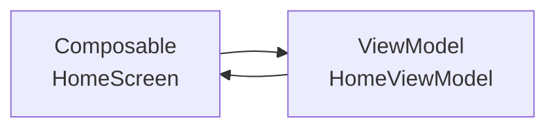

# Home Screen（ホーム画面）

## 構成図



---

## 層構造

### UI（Composable）

- HomeScreen

### ViewModel

- HomeViewModel
    - onReceivedClicked()
    - onCarryingClicked()
    - onCreateLetterClicked()

### Repository

- なし

### UseCase

- なし

---

## 状態（UiState）

HomeUiState

- userName : String

---

## ボタン

受信ボタン

- onClick → onReceivedClicked()

運搬ボタン

- onClick → onCarryingClicked()

手紙作成ボタン

- onClick → onCreateLetterClicked()

---

## コード

### ViewModel

```
class HomeViewModel : ViewModel() {

    fun onReceivedClicked() {}

    fun onCarryingClicked() {}

    fun onCreateLetterClicked() {}
}
```

---

### Composable

```
@Composable
fun HomeScreen(viewModel: HomeViewModel) {

    Column {

        Button(onClick = { viewModel.onReceivedClicked() }) {
            Text("受信")
        }

        Button(onClick = { viewModel.onCarryingClicked() }) {
            Text("運搬")
        }

        Button(onClick = { viewModel.onCreateLetterClicked() }) {
            Text("手紙作成")
        }
    }
}
```
