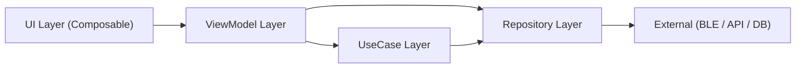
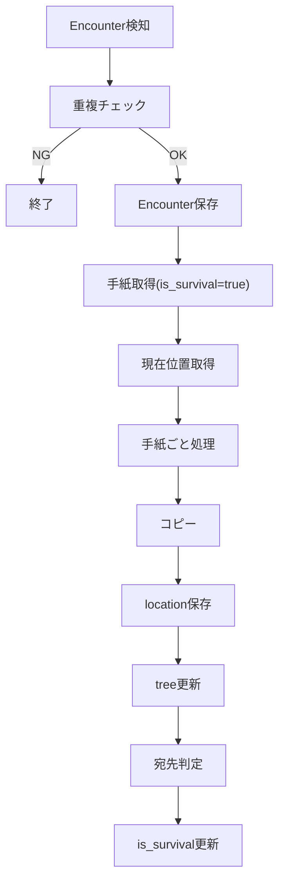
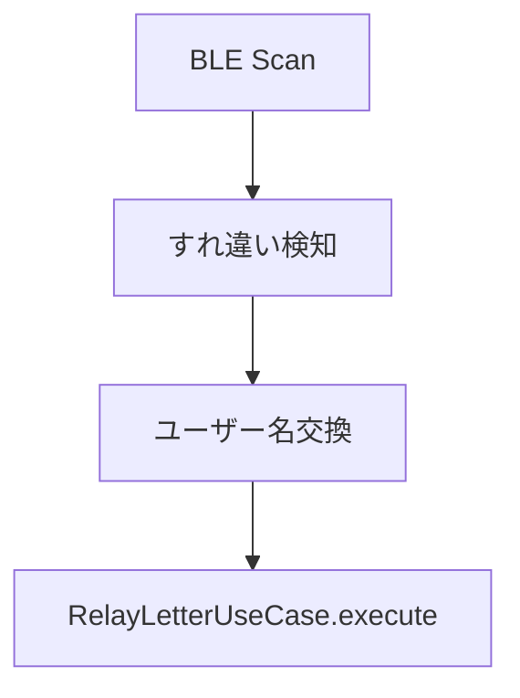
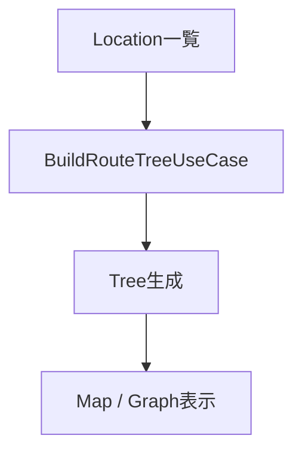

# アプリ全体設計（4層アーキテクチャ）

---

## 全体構成

---

## UI（Composable）

- RegisterScreen
- HomeScreen
- EditLetterScreen
- PostSelectScreen
- ReceivedScreen
- ReceivedDetailScreen
- RouteMapScreen
- CarryScreen
- CarryDetailScreen
- CarryMapScreen

---

## ViewModel

### RegisterViewModel

- onStartClicked()
- onNameChanged(text)
- onNameSubmitClicked()
- onPermissionResult(granted)

---

### HomeViewModel

- onReceivedClicked()
- onCarryingClicked()
- onCreateLetterClicked()

---

### EditLetterViewModel

- onToChanged(text)
- onSentenceChanged(text)
- onSaveDraftClicked()
- onSelectPostClicked()
- onPostSelected(post)
- onSubmitClicked()

---

### ReceivedViewModel

- loadReceivedLetters()
- onLetterClicked(letterId)
- loadLetterDetail(letterId)

---

### CarryViewModel

- loadCarryingLetters()
- onLetterClicked(letterId)
- loadLetterDetail(letterId)

---

## UseCase

### RelayLetterUseCase

- execute(myUserName, targetUserName)

---

### BuildRouteTreeUseCase

- buildTree(locations)

---

## Repository

### UserRepository

- saveUser(userName)
- getUser()

---

### LetterRepository

- getReceivedLetters(userName)
- getCarryingLetters(userName)
- getLetter(letterId)
- copyLetter(letter, newUser)
- updateSurvival(letterId, isAlive)

---

### LocationRepository

- saveLocation(location)
- getLocationsByLetter(letterId)

---

### DraftRepository

- saveDraft(draft)
- loadDraft()
- clearDraft()

---

### PostRepository

- getNearbyPosts(lat, lon)

---

### BleRepository

- startBle()
- onEncounter(callback)

---

### EncounterRepository

- getLastEncounter(userA, userB)
- saveEncounter(encounter)

---

### TreeRepository

- addNode(letterId, parentUser, newUser, location)

---

## UseCase詳細

### RelayLetterUseCase フロー

---

## データモデル

### User

- userName : String

---

### Letter

- letterId : String
- to : String
- from : String
- sentence : String
- is_survival : Boolean
- tree : Tree

---

### Location

- locationId : String
- letterId : String
- userName : String
- latitude : Double
- longitude : Double
- timestamp : Long

---

### Encounter

- encounterId : String
- userA : String
- userB : String
- timestamp : Long

---

### Tree

- nodes : List<Node>
- edges : List<Edge>

---

### Node

- id : String
- userName : String
- latitude : Double
- longitude : Double

---

### Edge

- fromNodeId : String
- toNodeId : String

---

## 特殊フロー

### BLE処理

---

### Tree生成（表示用）

---

## 状態（UI State）

### RegisterUiState

- userName : String
- isNameValid : Boolean
- isPermissionGranted : Boolean
- isCompleted : Boolean

---

### HomeUiState

- userName : String

---

### EditLetterUiState

- toName : String
- sentence : String
- selectedPost : Post?
- posts : List<Post>
- isLoading : Boolean
- errorMessage : String?

---

### ReceivedUiState

- letters : List<LetterSummary>
- selectedLetter : LetterDetail?
- routeTree : Tree?
- isLoading : Boolean
- errorMessage : String?

---

### CarryUiState

- letters : List<LetterSummary>
- selectedLetter : LetterDetail?
- routeTree : Tree?
- currentUserName : String
- isLoading : Boolean
- errorMessage : String?

---

## 重要ルール

- UIは状態のみ表示
- ViewModelは状態管理とイベント処理
- UseCaseはビジネスロジック
- Repositoryはデータ I/O
- BLEはUIに依存しない
- treeは表示用データ
- locationは履歴データ
- encounterはイベントログ

---
