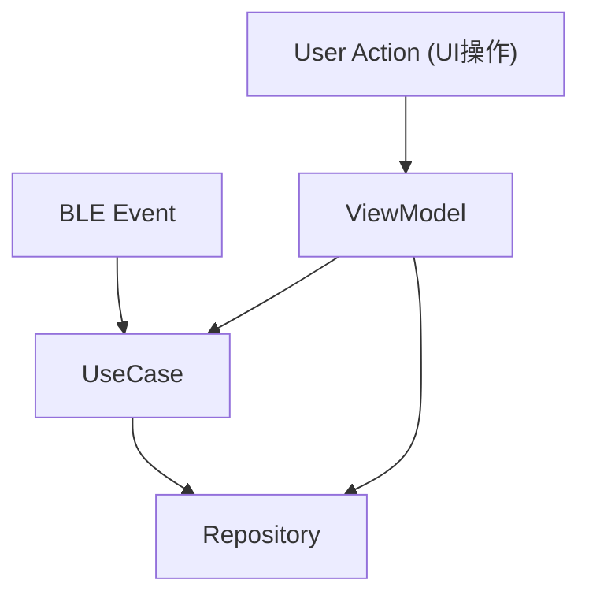
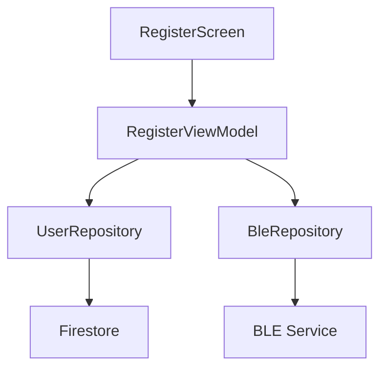
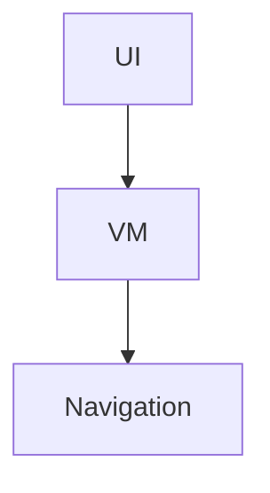
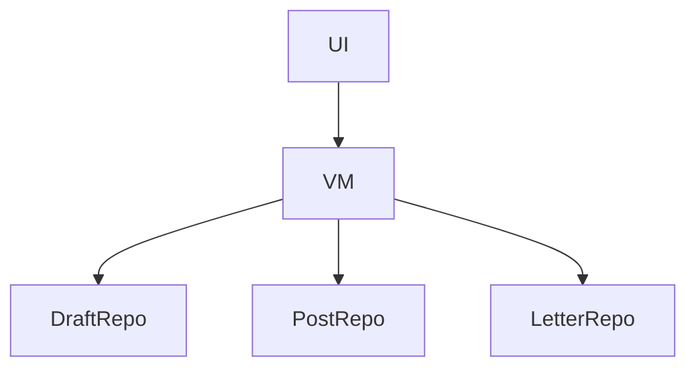
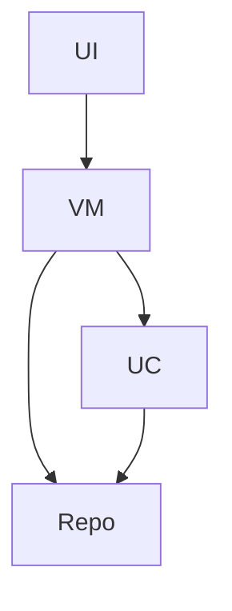
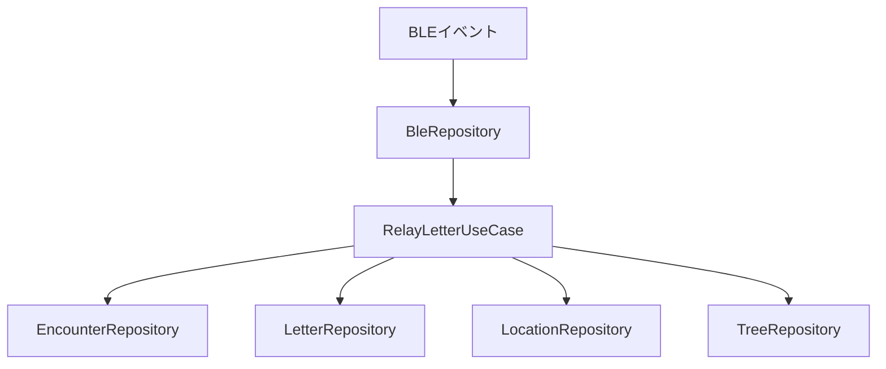
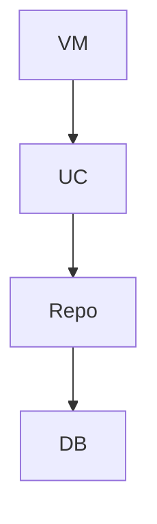

# 処理フロー定義（関数呼び出し設計）

---

## 全体フロー



---

# 1. ユーザー登録

## フロー



---

## 呼び出し順

```
UI: onStartClicked()
↓
UI: onNameChanged()
↓
UI: onNameSubmitClicked()
↓
ViewModel: saveUser()
↓
UserRepository: saveUser()

---

UI: 権限許可
↓
ViewModel: onPermissionResult()
↓
BleRepository: startBle()
```

---

# 2. ホーム画面

## フロー



---

## 呼び出し順

```
UI: onReceivedClicked()
→ Navigate to ReceivedScreen

UI: onCarryingClicked()
→ Navigate to CarryScreen

UI: onCreateLetterClicked()
→ Navigate to EditLetterScreen
```

---

# 3. 手紙作成

## フロー



---

## 呼び出し順

```
UI: onToChanged()
→ ViewModel: state更新

UI: onSentenceChanged()
→ ViewModel: state更新

UI: onSaveDraftClicked()
→ DraftRepository.saveDraft()

UI: onSelectPostClicked()
→ ViewModel → PostRepository.getNearbyPosts()

UI: onPostSelected()
→ ViewModel: state更新

UI: onSubmitClicked()
→ LetterRepository.saveLetter()
→ LocationRepository.saveLocation()
```

---

# 4. 受信画面

## フロー



---

## 呼び出し順

```
UI表示時:
→ ViewModel.loadReceivedLetters()
→ LetterRepository.getReceivedLetters()

---

UI: 手紙選択
→ ViewModel.onLetterClicked()
→ ViewModel.loadLetterDetail()

→ LocationRepository.getLocationsByLetter()
→ BuildRouteTreeUseCase.buildTree()
```

---

# 5. 運搬画面

## フロー


---

## 呼び出し順

```
UI表示時:
→ ViewModel.loadCarryingLetters()
→ LetterRepository.getCarryingLetters()

---

UI: 手紙選択
→ ViewModel.loadLetterDetail()

→ LocationRepository.getLocationsByLetter()
→ BuildRouteTreeUseCase.buildTree()
```

---

# 6. BLEすれ違い処理（核心）

## フロー



---

## 呼び出し順（重要）

```
BleRepository.onEncounter(targetUser)

→ RelayLetterUseCase.execute(myUser, targetUser)

---

UseCase内部:

① getLastEncounter()
→ EncounterRepository

② saveEncounter()
→ EncounterRepository

③ getCarriedLetters()
→ LetterRepository

④ getCurrentLocation()

⑤ for each letter:

    copyLetter()
    → LetterRepository

    saveLocation()
    → LocationRepository

    addNode()
    → TreeRepository

    updateSurvival()
    → LetterRepository
```

---

# 7. Tree生成（表示）

## フロー



---

## 呼び出し順

```
ViewModel.loadLetterDetail()

→ LocationRepository.getLocationsByLetter()

→ BuildRouteTreeUseCase.buildTree()

→ ViewModel.state更新

→ UI表示
```

---

# 8. 共通ルール（関数呼び出し）

---

## UI

```
UIは必ずViewModelを経由する
Repositoryを直接呼ばない
```

---

## ViewModel

```
状態更新
UseCase呼び出し
Repository呼び出し
```

---

## UseCase

```
複数Repositoryを組み合わせる
ビジネスロジックを持つ
```

---

## Repository

```
データ取得 / 保存のみ
ロジックを持たない
```

---

## BLE

```
BLE → UseCase直行
ViewModelを通らない
```

---

# 9. 呼び出しパターン一覧

---

## UIイベント型

```
UI → ViewModel → Repository
UI → ViewModel → UseCase → Repository
```

---

## BLEイベント型

```
BLE → UseCase → Repository
```

---

## 表示処理

```
UI → ViewModel → Repository → UseCase → UI
```

---

# まとめ

```
UI操作 → ViewModel起点
BLEイベント → UseCase起点

UseCase = 処理の中心
Repository = データ入出力
```

---
