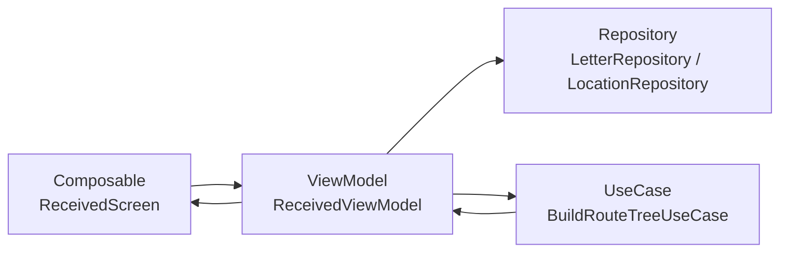

# Received Screen（受信画面）

## 構成図

---

## 層構造

### UI（Composable）

- ReceivedScreen
- ReceivedDetailScreen
- RouteMapScreen

---

### ViewModel

- ReceivedViewModel
    - loadReceivedLetters()
    - onLetterClicked(letterId)
    - loadLetterDetail(letterId)

---

### Repository

#### LetterRepository

- getReceivedLetters(userName)
- getLetter(letterId)

#### LocationRepository

- getLocationsByLetter(letterId)

---

### UseCase

#### BuildRouteTreeUseCase

- buildTree(locations)

---

## 状態（UiState）

ReceivedUiState

- letters : List<LetterSummary>
- selectedLetter : LetterDetail?
- routeTree : Tree?
- isLoading : Boolean
- errorMessage : String?

---

## ボタン / イベント

手紙選択ボタン

- onClick → onLetterClicked

戻るボタン

- Navigation処理

---

## データ構造

### LetterSummary

- letterId : Int
- from : String

---

### LetterDetail

- letterId : Int
- from : String
- to : String
- sentence : String

---

### Location

- latitude : Double
- longitude : Double
- userName : String

---

### Tree

- nodes : List<Node>
- edges : List<Edge>

---

### Node

- id : String
- userName : String
- latitude : Double
- longitude : Double

---

### Edge

- fromNodeId : String
- toNodeId : String
