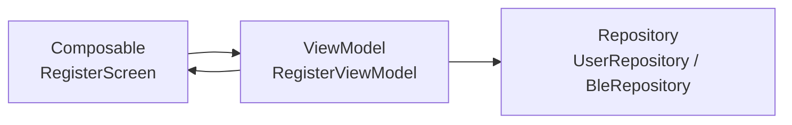

# Register Screen（ユーザー登録画面）

## 構成図

---

## 層構造

### UI（Composable）

- RegisterScreen
- PermissionRequestUI（権限許可）

---

### ViewModel

- RegisterViewModel
    - onStartClicked()
    - onNameChanged(text)
    - onNameSubmitClicked()
    - onPermissionResult(granted)

---

### Repository

#### UserRepository

- saveUser(userName)
- getUser()

#### BleRepository

- startBle()

---

### UseCase

- なし

---

## 状態（UiState）

RegisterUiState

- userName : String
- isNameValid : Boolean
- isPermissionGranted : Boolean
- isCompleted : Boolean

---

## ボタン / イベント

スタートボタン

- onClick → onStartClicked

名前入力

- onValueChange → onNameChanged

次へボタン

- onClick → onNameSubmitClicked

権限許可ボタン

- onClick → OSの権限リクエスト

権限結果

- onPermissionResult → onPermissionResult

---

## データ構造

### User

- userName : String

---

## フロー

スタートボタン押下

↓

ユーザー名入力

↓

UserRepositoryに保存

↓

権限許可

↓

BleRepositoryでBLE開始

↓

ホームへ遷移
