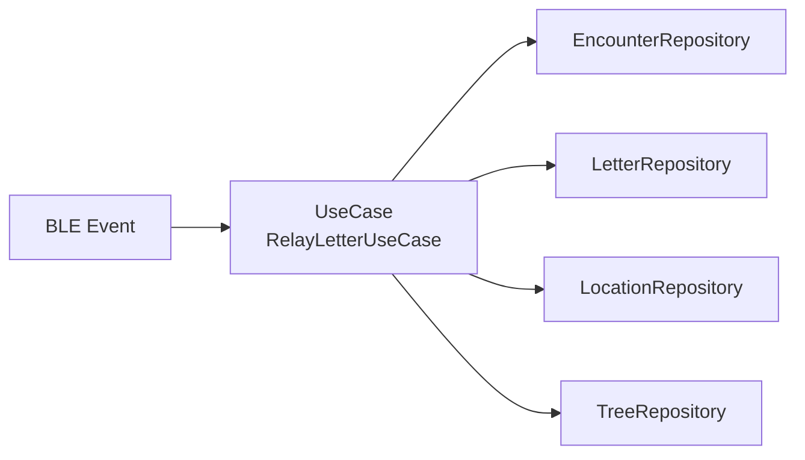

# Relay Letter UseCase（すれ違い処理）

## 構成図

---

## 層構造

### UseCase

- RelayLetterUseCase
    - execute(myUserName, targetUserName)

---

### Repository

#### EncounterRepository

- getLastEncounter(userA, userB)
- saveEncounter(encounter)

---

#### LetterRepository

- getCarriedLetters(userName)
- copyLetter(letter, newUser)
- updateSurvival(letterId, isAlive)

---

#### LocationRepository

- saveLocation(location)

---

#### TreeRepository

- addNode(letterId, parentUser, newUser, location)

---

---

## フロー

すれ違い検知（BLE）

↓

ユーザー名取得

↓

重複チェック

↓

すれ違い記録保存

↓

相手が運搬中の手紙取得（is_survival=trueのみ）

↓

現在位置取得

↓

各手紙に対して処理

- コピー
- location保存
- tree更新
- 宛先判定

---

## 処理詳細

### ① 重複チェック

同一ユーザーとの直近すれ違いを確認  
一定時間以内なら処理中断

---

### ② 手紙取得

対象：

- 相手が運搬中
- is_survival == true

---

### ③ location保存

保存タイミング：

- コピー成功時のみ

保存内容：

- userName
- latitude
- longitude
- timestamp

---

### ④ tree更新

更新方法：

- 親：相手ユーザー
- 子：自分ユーザー

---

### ⑤ 宛先判定

if (letter.to == 自分)

- is_survival = false

---

## データ構造

### Encounter

- userA : String
- userB : String
- timestamp : Long

---

### Location

- letterId : String
- userName : String
- latitude : Double
- longitude : Double
- timestamp : Long

---
