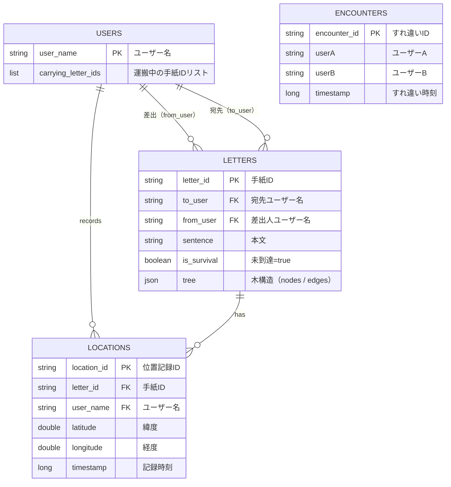

# BLE通信を使った手紙バケツリレー

## コンセプト
「すれ違い通信」という技術的制約を逆手に取り、デジタルでありながら「物理的な距離と時間」を感じさせるメッセージング体験を構築する。AさんからBさんへの手紙が、見知らぬ誰かのデバイスを経由して届く「一機一会」の物語を可視化する。
手紙はウイルスのように感染しながら広がる。すれ違った人全員が配達員になり、誰かが宛先とすれ違ったときに手紙の拡散は終わる。差出人は手紙を出した後、届いたのかもどんな経路をたどったかも知ることができない。それがこのアプリのいいところ？である。

---

## ターゲット
SNS時代に、あえて連絡を「困難」にして楽しみたい人。既読、通知、返信ストレスから解放されたい人。

---

## 機能一覧
### ユーザー登録（初回起動時のみ）
- ユーザー名（本名推奨）を登録する。変更は今回は考えてない。
- BLE権限・位置情報権限に同意する。
- 次回以降はデバイスにセッションが保存されており、ログイン操作不要で起動する。
- 同性同名は今回はスルー

### ホーム画面
- ポストのイラスト？表示されている。
- 自分あての手紙が届いている場合、ポストに手紙が刺さっているビジュアルになる。
- ポストをタップ又は受信ボタンをクリックすると自分あてに届いた手紙を一覧画面に遷移する。

### 手紙作成
- 宛先(本名)と本文(テキストのみ)を入力する。
- 一度に編集できる下書きは1通のみ。
- 戻るボタンを押すと、「下書き保持」か「削除」かを選べる。

### 投函
- 投函ボタンを押すと、現在地から1km以内(仮)の実在するポスト（郵便ポスト）が地図上で表示される。
- ポストを選択すると確認ダイアログが出る。
- 投函確定すると：
  - 手紙データがサーバーに登録される。
  - 手紙データの木構造に差出人がルートノードとして登録される。
  - 差出人自身の端末からは手紙の内容が見えなくなる。（送ったら最後何もわからないくなる。）

### BLEすれ違い処理
- アプリはバックグラウンドでも常時BLEをスキャンしている。
- すれ違いを検知したとき：
  1. BLEでお互いのユーザー名を交換する。
  2. 直近の重複すれ違いをチェックし、一定時間以内なら処理を中断する。（これで1日とかに設定したら1日一回のすれ違いにできるかも）
  3. すれ違いをサーバーに記録する。
  4. 相手が運搬中ので、まだ宛先に届いていない手紙を取得する。
  5. 各手紙に対して以下を実行する。
   - 手紙を自分の運搬リストに追加する。
   - すれ違い位置をサーバーに保持する。
   - 手紙の木構造に新しいノードを追加する。
   - 自分が宛先があれば手紙を「到達済み」にする。
- 一度渡した相手には同じ手紙を再度渡さない（木構造に相手のノードが存在するかで判定）。

### 運んでいる手紙一覧
- 現在自分が運んでいる手紙の一覧が表示される。（差出人、宛先のみ見える、手紙の内容は見れない）
- 手紙を選択すると、その手紙の経路をリアルタイムで地図上に表示する。
  - 各ノード（すれ違いポイント）がピンで表示される。
  - 自分が経由したノードは強調色で表示させる。（わかりやすくするため）
  - ノード感が線で結ばれ、経路が視覚的にわかる。

### 届いた手紙一覧
- 自分宛に届いた手紙の一覧
- 手紙を開くと本文と自分に届くまでの経路（誰を経路してきたか）が見られる。
- 差出人には通知が届かないため、気軽に読める。

## データ設計（Firestore）
 
