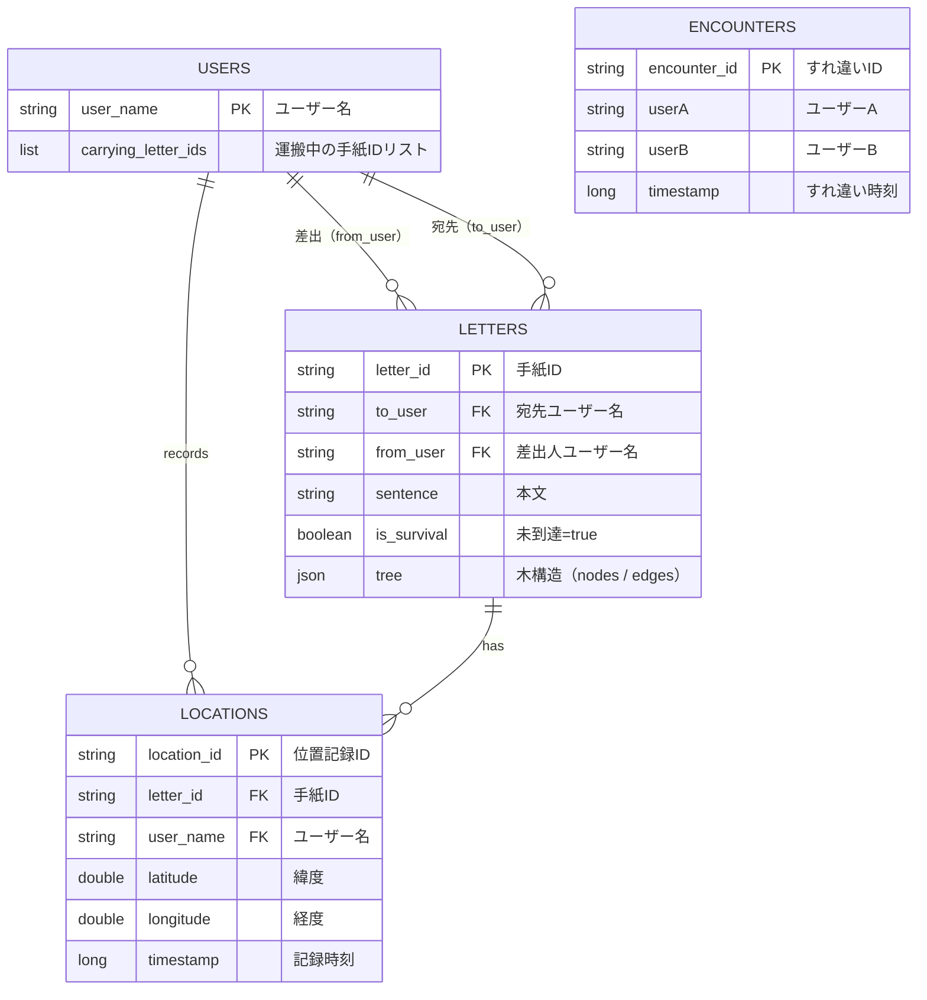

# BLE通信を使った手紙バケツリレー

## コンセプト
「すれ違い通信」という技術的制約を逆手に取り、デジタルでありながら「物理的な距離と時間」を感じさせるメッセージング体験を構築する。AさんからBさんへの手紙が、見知らぬ誰かのデバイスを経由して届く「一機一会」の物語を可視化する。
手紙はウイルスのように感染しながら広がる。すれ違った人全員が配達員になり、誰かが宛先とすれ違ったときに手紙の拡散は終わる。差出人は手紙を出した後、届いたのかもどんな経路をたどったかも知ることができない。それがこのアプリのいいところ？である。

---

## ターゲット
SNS時代に、あえて連絡を「困難」にして楽しみたい人。既読、通知、返信ストレスから解放されたい人。

---

## 機能一覧
### ユーザー登録（初回起動時のみ）
- ユーザー名（本名推奨）を登録する。変更は今回は考えてない。
- BLE権限・位置情報権限に同意する。
- 次回以降はデバイスにセッションが保存されており、ログイン操作不要で起動する。
- 同性同名は今回はスルー

### ホーム画面
- ポストのイラスト？表示されている。
- 自分あての手紙が届いている場合、ポストに手紙が刺さっているビジュアルになる。
- ポストをタップ又は受信ボタンをクリックすると自分あてに届いた手紙を一覧画面に遷移する。

### 手紙作成
- 宛先(本名)と本文(テキストのみ)を入力する。
- 一度に編集できる下書きは1通のみ。
- 戻るボタンを押すと、「下書き保持」か「削除」かを選べる。

### 投函
- 投函ボタンを押すと、現在地から1km以内(仮)の実在するポスト（郵便ポスト）が地図上で表示される。
- ポストを選択すると確認ダイアログが出る。
- 投函確定すると：
  - 手紙データがサーバーに登録される。
  - 手紙データの木構造に差出人がルートノードとして登録される。
  - 差出人自身の端末からは手紙の内容が見えなくなる。（送ったら最後何もわからないくなる。）

### BLEすれ違い処理
- アプリはバックグラウンドでも常時BLEをスキャンしている。
- すれ違いを検知したとき：
  1. BLEでお互いのユーザー名を交換する。
  2. 直近の重複すれ違いをチェックし、一定時間以内なら処理を中断する。（これで1日とかに設定したら1日一回のすれ違いにできるかも）
  3. すれ違いをサーバーに記録する。
  4. 相手が運搬中ので、まだ宛先に届いていない手紙を取得する。
  5. 各手紙に対して以下を実行する。
   - 手紙を自分の運搬リストに追加する。
   - すれ違い位置をサーバーに保持する。
   - 手紙の木構造に新しいノードを追加する。
   - 自分が宛先があれば手紙を「到達済み」にする。
- 一度渡した相手には同じ手紙を再度渡さない（木構造に相手のノードが存在するかで判定）。

### 運んでいる手紙一覧
- 現在自分が運んでいる手紙の一覧が表示される。（差出人、宛先のみ見える、手紙の内容は見れない）
- 手紙を選択すると、その手紙の経路をリアルタイムで地図上に表示する。
  - 各ノード（すれ違いポイント）がピンで表示される。
  - 自分が経由したノードは強調色で表示させる。（わかりやすくするため）
  - ノード感が線で結ばれ、経路が視覚的にわかる。

### 届いた手紙一覧
- 自分宛に届いた手紙の一覧
- 手紙を開くと本文と自分に届くまでの経路（誰を経路してきたか）が見られる。
- 差出人には通知が届かないため、気軽に読める。

## データ設計（Firestore）
 

### 各フィールドの補足
 
**USERS**
- `carrying_letter_ids` — 自分が今運んでいる手紙のIDリスト。すれ違い時に追加される。これがないと「運搬中の手紙一覧」を全LETTERSから検索しないといけなくなる。
**LETTERS**
- `is_survival` — まだ宛先に届いていない手紙かどうか。`false`になると他のユーザーへの感染が止まる。
---

## 関数一覧
### ViewModel
#### RegisterViewModel
| 関数 | 入力 | 出力 | 内容 |
|---|---|---|---|
| `onStartClicked()` | なし | なし | スタートボタン押下。名前入力UIを表示する |
| `onNameChanged(text)` | ユーザー名 | なし | 名前入力フィールドの変更を受け取り、状態を更新する |
| `onNameSubmitClicked()` | ユーザー名 | なし | `UserRepository.saveUser()`を呼んでユーザーテーブルにユーザー名を保存する |
| `onPermissionResult(granted)` | 許可したか | なし | 権限許可の結果を受け取り、許可済みなら`BleRepository.startBle()`を呼ぶ |

#### HomeViewModel
| 関数 | 入力 | 出力 | 内容 |
|---|---|---|---|
| `onReceivedClicked()` | なし | なし | 届いた手紙一覧画面へ遷移 |
| `onCarryingClicked()` | なし | なし | 運搬中手紙一覧画面へ遷移 |
| `onCreateLetterClicked()` | なし | なし | 手紙作成画面へ遷移 |

#### EditLetterViewModel
| 関数 | 入力 | 出力 | 内容 |
|---|---|---|---|
| `onCreateLetter()` | なし | なし | ローカルに下書きが保存されていれば読み込み、なければ空白で初期化する |
| `onToChanged(text)` | 宛先名 | なし | 宛先入力の変更を受け取り、状態を更新する |
| `onSentenceChanged(text)` | 本文 | なし | 本文入力の変更を受け取り、状態を更新する |
| `onSaveDraftClicked()` | 内容 | なし | `DraftRepository.saveDraft()`を呼んで下書きをローカルに保存する |
| `onSelectPostClicked()` | 現在位置（緯度・経度） | ポスト座標リスト | 現在位置を取得し、`PostRepository.getNearbyPosts()`を呼んで周辺のポスト一覧を取得する |
| `onPostSelected(post)` | 選択したポスト | なし | 選択されたポストを状態に反映する |
| `onSubmitClicked()` | ユーザー名 | なし | `LetterRepository.sendLetter()`でletterに手紙を登録し、`LocationRepository.saveLocation()`でlocationに位置を登録する |

#### ReceivedViewModel
| 関数 | 入力 | 出力 | 内容 |
|---|---|---|---|
| `loadReceivedLetters()` | ユーザー名 | 受信手紙ID一覧 | `LOCATIONS`をユーザー名で絞り、`letter_id`と`LETTERS`を結び付けて宛先が自分のものを返す |
| `onLetterClicked(letterId)` | 手紙ID | なし | 手紙選択。`loadLetterDetail()`を呼ぶ |
| `loadLetterDetail(letterId)` | 手紙ID | 手紙詳細 | `LETTERS`を`letter_id`で絞って宛先・差出人・内容・木を返す |

#### CarryViewModel
| 関数 | 入力 | 出力 | 内容 |
|---|---|---|---|
| `loadCarryingLetters()` | ユーザー名 | 運搬手紙一覧 | `LOCATIONS`をユーザー名で絞り、`letter_id`を返す |
| `onLetterClicked(letterId)` | 手紙ID | なし | 手紙選択。`loadLetterDetail()`を呼ぶ |
| `loadLetterDetail(letterId)` | 手紙ID | 地図（Tree） | `LETTERS`を`letter_id`で絞り、木のノード全てに対してユーザー名と`letter_id`で緯度経度を取得し、`BuildRouteTreeUseCase.buildTree()`で木として返す |
 
---

### UseCase
#### RelayLetterUseCase
| 関数 | 入力 | 出力 | 内容 |
|---|---|---|---|
| `execute(myUserName, targetUserName)` | 自分・相手のユーザー名 | なし | すれ違い検知時に呼ばれる。重複チェック・手紙取得・位置保存・tree更新・宛先判定を一括で行う |

#### BuildRouteTreeUseCase
| 関数 | 入力 | 出力 | 内容 |
|---|---|---|---|
| `buildTree(locations)` | 位置履歴一覧 | Tree | `LOCATIONS`の一覧からノードとエッジを生成し、地図表示用の`Tree`を返す |
 
---

### Repository
#### UserRepository
| 関数 | 入力 | 出力 | 内容 |
|---|---|---|---|
| `saveUser(userName)` | ユーザー名 | なし | ユーザー名をFirestoreのUSERSに保存する |
| `getUser()` | なし | User | 保存済みのユーザー情報を取得する |

#### LetterRepository
| 関数 | 入力 | 出力 | 内容 |
|---|---|---|---|
| `sendLetter(letter)` | 手紙データ | なし | 手紙をFirestoreのLETTERSに新規登録する |
| `getReceivedLetters(userName)` | ユーザー名 | 受信手紙ID一覧 | `to_user=自分`かつ`is_survival=false`の手紙一覧を取得する |
| `getCarryingLetters(userName)` | ユーザー名 | 運搬手紙一覧 | 自分が運搬中の手紙一覧を取得する |
| `getLetter(letterId)` | 手紙ID | 手紙詳細 | 指定IDの手紙詳細を取得する |
| `getCarriedLetters(userName)` | ユーザー名 | 手紙一覧 | 相手が運搬中（`is_survival=true`）の手紙一覧を取得する（すれ違い処理用） |
| `updateSurvival(letterId, isAlive)` | 手紙ID・bool | なし | 手紙の`is_survival`を更新する |

