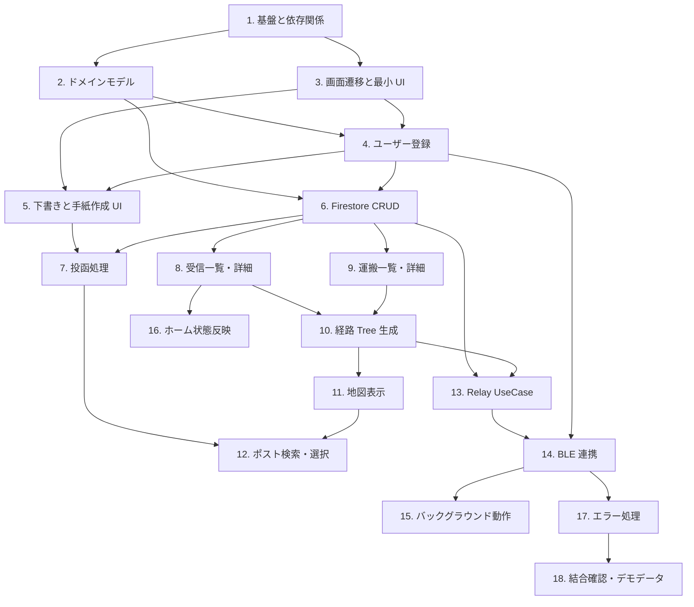

# 実装計画

この計画は `MEMO/作るもの.md` を前提に、後で GitHub Project の Issue にしやすい機能単位で並べたもの。画面デザインは別進行のため、各画面は検証に必要な最小限の Compose UI で進める。

## 方針

- まずアプリがビルドでき、画面遷移できる状態を作る。
- 次にローカルだけで確認できる登録・下書き・一覧表示を作る。
- Firestore の読み書きは、Relay 処理や受信/運搬一覧の前提になるため早めに固める。
- BLE、位置情報、Google Maps、Overpass API は実機・権限・外部サービス依存が強いため後半に回す。
- 各タスクは原則として 1 ブランチ 1 機能で切る。
- 各タスク開始前に、必要になりそうな追加ファイルを先に洗い出し、`作るもの.md` と `割り振り.md` に反映してから実装する。

## 先に作成した予定ファイル

以下は今後のタスクで使う可能性が高いため、空ファイルとして先に作成済み。
中身は該当タスクで実装する。

- `data/datasource/firestore/FirebaseTaskExt.kt`
- `data/datasource/location/CurrentLocationDataSource.kt`
- `data/datasource/remote/OverpassPostDataSource.kt`
- `notification/BleNotificationHelper.kt`
- `service/BleForegroundService.kt`

## 実装順

### 1. プロジェクト基盤と依存関係の整備

**目的**
Compose Navigation、ViewModel、Coroutine、Firebase、Google Maps、位置情報、BLE など、以降の実装に必要な依存関係と設定を入れる。

**作業**
- `libs.versions.toml` と `app/build.gradle.kts` に必要ライブラリを追加する。
- Firebase を使うための Gradle 設定を追加する。
- `AndroidManifest.xml` に BLE・位置情報・インターネット権限を追加する。
- 必要なら Hilt などの DI 方針を決め、最小構成を追加する。

**依存**
- なし

**完了条件**
- 空の画面でも Android アプリとしてビルドできる。
- 以降の ViewModel / Repository / Firebase 実装で必要な import が使える。

### 2. ドメインモデルの実装

**目的**
Repository、UseCase、ViewModel が共通して扱うデータ型を先に確定する。

**作業**
- `User`, `Letter`, `Location`, `Encounter`, `Node`, `Edge`, `Tree`, `Post` を data class として実装する。
- Firestore 変換を見据えて、空コンストラクタまたはデフォルト値を用意する。
- `letterId`, `userName`, `isSurvival` など、Firestore フィールド名との対応を整理する。

**依存**
- 1

**完了条件**
- すべてのモデルが Kotlin としてコンパイルできる。
- `Post.kt` が追加されている。

### 3. 画面遷移と最小 UI の土台

**目的**
全画面へ遷移できる最低限のアプリ骨格を作る。以降の機能確認を画面上でできるようにする。

**作業**
- `Destinations.kt` にルート定数を定義する。
- `AppNavGraph.kt` に `NavHost` と各画面の `composable` を実装する。
- `MainActivity.kt` から `AppNavGraph` を呼ぶ。
- `HomeScreen` に受信、運搬、手紙作成への最小ボタンを置く。
- `CommonButton` など最低限の共通 UI を作る。

**依存**
- 1

**完了条件**
- Register / Home / EditLetter / Received / Carry へ遷移できる。
- 詳細画面は仮 ID でも開ける。

### 4. ユーザー登録とローカルセッション

**目的**
初回登録と次回起動時のユーザー復元を実装する。BLE や Firestore の前に、現在ユーザーを参照できる状態を作る。

**作業**
- `UserRepository` と `UserFirestoreDataSource` の最小実装を作る。
- ローカルに現在ユーザー名を保存する仕組みを作る。
- `RegisterViewModel` にユーザー名入力、保存、登録済み判定を実装する。
- `RegisterScreen` に名前入力と開始ボタンを実装する。
- 登録済みなら Home に遷移する。

**依存**
- 2, 3

**完了条件**
- ユーザー名を登録できる。
- アプリ再起動後も同じユーザーとして Home に入れる。

### 5. 下書き保存と手紙作成 UI

**目的**
Firestore やポスト選択なしで、宛先と本文の入力・下書き保存を確認できるようにする。

**作業**
- `DraftLocalDataSource` を SharedPreferences などで実装する。
- `DraftRepository` を実装する。
- `EditLetterViewModel` に宛先、本文、下書き保存、下書き読み込み、削除を実装する。
- `EditLetterScreen` に宛先入力、本文入力、下書き保存、削除、投函へ進むボタンを置く。
- 戻る時の「下書き保持 / 削除」は最低限の確認ダイアログで実装する。

**依存**
- 3, 4

**完了条件**
- 1 通だけ下書きを保存・復元・削除できる。
- 手紙作成画面の入力状態が ViewModel に反映される。

### 6. Firestore データ層の基本 CRUD

**目的**
手紙、位置、すれ違い、木構造を保存・取得できる Repository 層を作る。

**作業**
- `LetterFirestoreDataSource` を実装する。
- `LocationFirestoreDataSource` を実装する。
- `EncounterFirestoreDataSource` を実装する。
- `TreeFirestoreDataSource` を実装する。
- `LetterRepository`, `LocationRepository`, `EncounterRepository`, `TreeRepository` を実装する。
- Firestore の collection 名、field 名を定数化する。

**依存**
- 2, 4

**完了条件**
- 手紙作成、位置保存、すれ違い保存、木構造更新に必要な関数が suspend 関数として使える。
- Repository は DataSource の薄いラッパーに留まり、ビジネスロジックを持たない。

### 7. 投函処理の最小実装

**目的**
作成した手紙を Firestore に登録し、差出人を root node として保存する。

**作業**
- `EditLetterViewModel.onSubmitClicked()` を実装する。
- `LetterRepository.sendLetter()` で `LETTERS` に保存する。
- `LocationRepository.saveLocation()` で投函位置を保存する。
- `TreeRepository.addNode()` または初期 tree 作成で差出人 root を作る。
- 投函後に下書きを削除し、差出人端末では本文を見られない状態にする。
- ポスト選択が未実装でも検証できるよう、暫定の現在地または仮座標で投函できる導線を用意する。

**依存**
- 5, 6

**完了条件**
- 手紙が Firestore に登録される。
- 差出人の root node と投函位置が保存される。
- 投函後、作成画面に本文が残らない。

### 8. 受信手紙一覧と詳細表示

**目的**
自分宛に届いた手紙を確認できる画面を作る。

**作業**
- `ReceivedViewModel.loadReceivedLetters()` を実装する。
- `ReceivedViewModel.loadLetterDetail()` を実装する。
- `ReceivedScreen` に一覧を表示する。
- `ReceivedDetailScreen` に差出人、本文、経路の概要を表示する。
- 経路地図が未実装の場合は、まずテキストまたは簡易リストで経路を表示する。

**依存**
- 6

**完了条件**
- `to_user = 自分` かつ `is_survival = false` の手紙を一覧表示できる。
- 詳細で本文を読める。

### 9. 運搬中手紙一覧と詳細表示

**目的**
自分が運搬中の手紙を確認できる画面を作る。

**作業**
- `CarryViewModel.loadCarryingLetters()` を実装する。
- `CarryViewModel.loadLetterDetail()` を実装する。
- `CarryScreen` に運搬中手紙一覧を表示する。
- `CarryDetailScreen` に差出人、宛先、到達状態、経路概要を表示する。
- 本文は表示しない。

**依存**
- 6

**完了条件**
- 自分が運んでいる手紙を一覧表示できる。
- 詳細でも本文が見えない。

### 10. 経路 Tree 生成 UseCase

**目的**
受信詳細・運搬詳細・地図表示で使う経路データを生成する。

**作業**
- `BuildRouteTreeUseCase.buildTree()` を実装する。
- `Location` の時系列から `Node` と `Edge` を作る。
- Firestore の `LETTERS.tree` と `LOCATIONS` のどちらを正とするかを決め、必要なら `tree` を優先する。
- Unit Test で、単純な直線経路と分岐経路を検証する。

**依存**
- 2, 6, 8, 9

**完了条件**
- 経路表示用の `Tree` が生成できる。
- 分岐を含む最低限のテストが通る。

### 11. 地図表示の共通コンポーネント

**目的**
ポスト選択、受信経路、運搬経路で共通利用する地図 UI を作る。

**作業**
- Google Maps SDK を使う `MapView` または Compose Maps コンポーネントを実装する。
- marker と line を表示できる API にする。
- `RouteMapScreen` と `CarryMapScreen` で Tree を表示する。
- 運搬画面では自分の node / edge を強調する。

**依存**
- 1, 10

**完了条件**
- Tree の node が marker、edge が line として表示される。
- 受信経路と運搬経路の両方で使える。

### 12. ポスト検索とポスト選択

**目的**
現在地から近い実在ポストを選んで投函できるようにする。

**作業**
- 現在地取得処理を実装する。
- `PostRepository.getNearbyPosts()` を Overpass API などで実装する。
- `PostSelectScreen` に近隣ポストを表示する。
- ポスト選択後、確認ダイアログを出す。
- 選択したポスト座標を投函処理に渡す。

**依存**
- 7, 11

**完了条件**
- 現在地 1km 以内のポスト候補を取得できる。
- 選択したポスト座標で手紙を投函できる。

### 13. RelayLetterUseCase の実装

**目的**
BLE から呼ばれる中核ロジックを、実機 BLE なしでもテストできる形で完成させる。

**作業**
- `RelayLetterUseCase.execute(myUserName, targetUserName)` を実装する。
- 直近すれ違いの重複チェックを実装する。
- 相手が運搬中の未到達手紙を取得する。
- 自分がすでに tree に含まれる手紙はスキップする。
- 自分の運搬リストに追加する。
- 位置情報を保存する。
- tree に node / edge を追加する。
- 自分が宛先なら `is_survival = false` に更新する。
- Unit Test で重複、再配布防止、宛先到達を検証する。

**依存**
- 6, 10

**完了条件**
- BLE なしで UseCase 単体テストができる。
- 同じ相手・同じ手紙を不必要に再処理しない。

### 14. BLE スキャン・アドバタイズ連携

**目的**
端末同士のすれ違いを検知し、Relay 処理を起動する。

**作業**
- `BleAdvertiser` で自分の userName を発信する。
- `BleScanner` で周囲の userName を検知する。
- `BleManager` で scan / advertise の開始停止を管理する。
- `BleRepository.startBle()` と `onEncounter()` を実装する。
- 登録完了後または起動時に BLE を開始する。
- Android 12 以降の Bluetooth 権限を処理する。

**依存**
- 4, 13

**完了条件**
- 2 台の実機または検証可能な環境で userName 交換を確認できる。
- 検知時に `RelayLetterUseCase.execute()` が呼ばれる。

### 15. バックグラウンド動作の整理

**目的**
アプリを開いていない時にも、可能な範囲で BLE 処理が続くようにする。

**作業**
- Foreground Service の必要性を判断する。
- 必要なら BLE 用 service と通知を実装する。
- OS バージョン別の制約を確認する。
- バッテリー最適化やスキャン間隔を調整する。

**依存**
- 14

**完了条件**
- 画面を閉じても想定範囲で BLE 検知が続く。
- 権限不足や OS 制限時にアプリが落ちない。

### 16. ホーム画面の状態反映

**目的**
自分宛の手紙が届いているかをホームで分かるようにする。

**作業**
- `HomeViewModel` で受信済み未読または受信済み件数を取得する。
- `HomeScreen` のポスト表示を状態に応じて切り替える。
- 最小デザインとして、最初はテキストや簡易アイコンで状態を表現する。

**依存**
- 8

**完了条件**
- 自分宛の到達済み手紙がある場合、ホームで分かる。
- 受信一覧へ遷移できる。

### 17. エラー処理とローディング状態

**目的**
外部サービスや権限まわりの失敗でユーザーが詰まらないようにする。

**作業**
- 各 ViewModel に loading / error state を追加する。
- Firestore 失敗、位置情報失敗、BLE 権限なし、ポスト検索失敗を画面に表示する。
- 再試行できる箇所には再試行ボタンを置く。

**依存**
- 7, 8, 9, 12, 14

**完了条件**
- 主要機能で失敗時にクラッシュしない。
- 最低限のエラーメッセージと再試行導線がある。

### 18. 結合確認とデモ用データ整備

**目的**
ハッカソン発表やチーム内確認で使える状態にする。

**作業**
- Firestore にテスト用ユーザー・手紙・経路データを用意する。
- 1 台でも受信/運搬/経路表示を確認できるデバッグ導線を作る。
- 複数端末で BLE から投函・中継・到達まで確認する。
- README または MEMO に動作確認手順を書く。

**依存**
- 14, 17

**完了条件**
- デモ手順に沿って主要体験を確認できる。
- 実機 BLE が不安定でも、デバッグデータで画面説明ができる。

## 優先度の目安

**MVP 必須**
1 から 10、13、14。  
手紙を作る、登録する、運ぶ、届いたものを見る、という体験の芯に必要。

**体験向上**
11、12、16、17。  
地図、ポスト選択、ホーム状態、失敗時表示など、使いやすさと見た目の説得力を上げる。

**時間があれば**
15、18 の一部。  
バックグラウンド BLE は重要だが OS 制約が強いため、ハッカソンでは最初から完璧を狙いすぎない。

## 依存関係の概要

